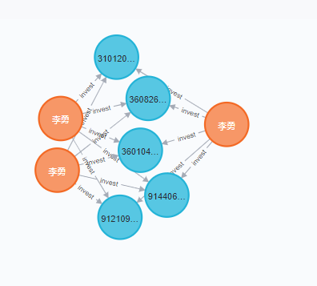
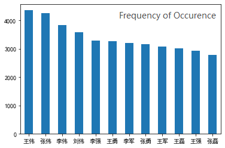
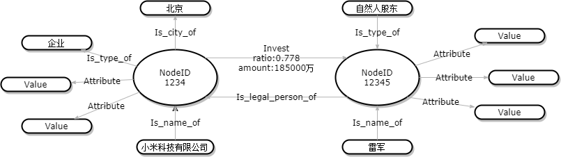
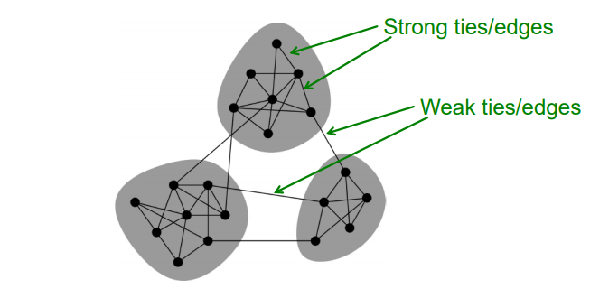

	

	<h2>
		Named Entity Disambiguation in Enterprise Knowledge Graph
	</h2>

 

	<h3>
		Milestone Report
	</h3>

   <h4>
       VE444 Networks - Group 7
    </h4> 

------------------------------------------

|      Name       |    Stud. ID    |
| :-------------: | :------------: |
| *Zhou Zhanpeng* | *518021910594* |
| *Tian Yuchuan* | *518370910040* |
| *Jin Haoxiang* | *518370910215* |

-------------------------------
### Abstract

**Enterprise knowledge graph** leverages collections of interlinked entities to represent enterprise basic information and the investment relationship between enterprises and investors, which could be a great weapon in investment analysis. However, it is not uncommon to see two different executives or investors with the same name in the enterprise KG. This brings great hidden troubles to the precision of investment analysis. Therefore, in this project, we aim to explore models including **Node Embedding** and **GNN (Graph Neural Networks)** that can tackle the **Named Entity Disambiguation(NED)** problem using the network structure that is intrinsic to the problem and present an analysis of the models.

**Key Words:** GNN, Entity Disambiguation, Knowledge Graph, Node Embedding.

### Introduction

**Knowledge graph (KG)** in the enterprise field provides an effective solution for solving financial problems. In many cases, financial institutions need to understand the various relationships between enterprises and related parties, and gain insight into enterprise risk transmission, abnormal transactions and other information. Knowledge graph describes concepts, entities and their relationships in the objective world in a structured form, expresses the information of the Internet in a form closer to the cognitive world of human beings, and provides an ability to better organize, manage and understand massive information on the Internet. So, constructing knowledge graph which contains the basic information of the enterprise and the investment relationship information of the enterprise could help us solve many reasoning problems existing in the financial field.

However, when constructing an enterprise knowledge graph based on raw data, ambiguity is often encountered. In raw data, it is not uncommon to have two different entities with the same name. For example, we all know that Jun Lei is the actual controller of Xiaomi Technology Co., LTD, but here is another person named Lei Jun in our data who is actual controller of Shenzhen Mizuan jewelry Co. LTD. There is more concrete example shown in Fig 1. 

    <h6>
        Fig 1. Named Disambiguation Problem Example
    </h6>

By common sense, we can easily distinguish the two people with the same name because the two companies' main businesses are quite different. But, in real-world data, we tend to have thousands of name ambiguities, and it's unrealistic to manipulate them one by one. 

In this project, we aim to explore an efficient named disambiguation technique to disambiguate different entities in Enterprise Knowledge Graph with the same name. We study the problem from a network perspective where entities in the Enterprise Knowledge Graph are connected due to investment relationships and each node or entity can be classified into two types, viz. company node and investor node. We believe that this inherent structure will be able to provide enough implicit and intrinsic features that could resolve the **NED** problem effectively.

### Data Set

#### Data Source

The data for training and testing our models and algorithms all comes from The National Enterprise Credit Information Publicity System (国家企业信用公示系统). The National Enterprise Credit Information Publicity System provides information reporting, publicity and inquiry services for national enterprises, farmers' professional cooperatives, individual industrial and commercial households and other market entities. According to the Regulations of the People's Republic of China on The Disclosure of Government Information and the Provisional Regulations on Enterprise Information Disclosure, the data we collect from the system are completely legal. 

#### Data Pre-processing And Summary

According to the content of the collected data, we divide the data into three tables, including `company_information.csv`, `company_to_company.csv` and `person_to_company.csv`. Among these three csv files, `company_information.csv` presents us the detailed information of each companies, including the name, type of company, the legal person, the registered address and etc; `company_to_company.csv` contains the information of investment relationships between companies; `person_to_company.csv` contains the information of inverstment relationships between investors and companies. The information, such that the address of each company and inversted relationship between investors and companies, could have great contribution to resolve the named disambiguation problem in enterprise knowledge graph. 

To show visualize the existing NED problem in enterprise knowledge graph, we counted the frequencies of each name of legal person of companies in `company_information.csv` and picked the top 12 names as shown in Fig 2. 

    <h6>
        Fig 2. Frequency of Occurences of Top 12 names in company_information.csv 
    </h6>

More than 15 names occur more than 1,500 times and more than 150 names occur more than 1,000 times, which shows the necessarity of our study on NED problem in enterprise knowledge graph.

### Related work

Name ambiguation problems have been the focus of lots of research. [1] looks at author name disambiguation in academic publication datasets, performing paradigm supervised learning on features like conference, title, and co-authors to figure out a linkage mapping between an author with his/her publication. However, [1] ignores the implicit connections in the dataset between features and entities. [2] looks at the issue further by extensively discussing using a random forest classifier to choose a minimal subset of features, greatly enhancing efficiency. This reduced dataset enhances efficiency, but again neglected possible relations since possibly relevant features are discarded. Those two methods did not cast insight into the existing network structure in the dataset; this result in the inefficiency and redundancy of information gathering, as network structures effective reveal potential linkage relations that help disambiguation.

Another main disadvantage in those two works is that the number of clusters need to be preset, which could be hard in actual cases. [3] and [4] resolves the problem by estimating the number of people having the same name. In details, they seek similarity between certain prominent features to form a graph structure, and they dynamically learn the cluster size based on the graph structure. It is notable that connections in graph structures are emphasized; but they used basic algorithms for the quantification of similarity between graph nodes, which is confined to only a handful of features in the dataset. Hence the disambiguation effect is confined and limited.

However, challenges increase as more people get involved in the dataset and more commonly shared features exist. Hence breaking the whole graph into clusters may result in mismatches. [5] tackles the issue by proposing a meta-path channel based node embedding method that maintains the completeness of the whole graph instead of breaking it up into subgraphs, and acting it on a more comprehensive dataset with relations embedded. This approach takes full advantage of all relations in the dataset, because: 1. Graphs are effective representatives of entities, features and relations; 2. Analyzing the graph as a whole avoids incapability and inefficiency of the learning model to grasp and learn.

We perform node embedding in a similar way to extract relational features regarding meta-paths in the graph and take adventage of other supplementary related information. Since each entity is represented in low dimensional embeddings, the whole disambiguation task in this project is boiled down to clustering in low dimensions, a mature and simple problem that is easy to tackle. This approach proves to yield optimal results in experiments in [6,7,8], in comparison to other approaches.

### Methods

#### Problem Formulation

We formulate the problem of named entity disambiguation as finding the similarity between nodes in the Enterprise Knowledge Graph. Given a set of companies and investors, we construct a directed graph as shown in Fig 3. In the graph, `NodeID` can be the ID either for companies or for investors, the directed edges are used to represent the investment relationship between company and investor or company and company. Also, the small nodes surrounding `NodeID` are all attributes which are not contained in the structure of the graph.

    <h6>
        Fig 3. Simple Model of Enterprise Knowledge Graph
    </h6>

Formally, given a set of companies and investors, we construct an directed Enterprise Knowledge graph $\mathcal{G}$ as follows:
$$
\begin{aligned}
&\mathcal{G} = (C, I, E)\\
&C = \{a | a \in {\rm companies} \}\\
&I = \{b | b \in {\rm investors}\}\\
&E = \{(b, a), (a, c) | a,c \in C , b \in I\}
\end{aligned}
$$
Now, we define the task of named entity disambiguation problem as binary classification problem to classifying the entities with the same name into “same entity group” or ”different entity group” based on some binary node classifier *Node_classifier*. Formally, the classification is shown below.
$$
\begin{aligned}
node\_classifier(a,b)\ \rm where\ a,b \in I 
\end{aligned}
$$
If the binary classifier returns true, which means the two node are actually the same node, otherwise, are different nodes. We will implement the *node_classifier* based on **SCC**, **node embedding** and **graph neural networks**.

#### Evaluation

The evaluation metric used in the task is macro-averaged F-1 score defined as below:
$$
\begin{aligned}
\rm Pairwise\ precision &= \frac{\rm \# pairs\ correctly\ classified\ to\ same\ entity}{\rm \#Total\ pairs\ classified \ to\ SameEntity}\\
\rm Pairwise\ recall &= \frac{\rm \#Pairs\ correctly\ classified\ to\ same\ entity}{\rm \#Total\ pairs\ classfied\ correctly}\\
\rm Pairwise\ F_1 &= \frac{\rm 2\times Pairwise\ precision \times Pairwise\ recall}{\rm Pairwise\ precision + Pairwise\ recall}
\end{aligned}
$$

#### Baseline Classification

We implement two baseline methods and study the performance of other advanced models or algorithms with respect to them. 

1. **ClassifyByName**: For the first baseline method, we directly classify entity with same name into “same entity group”. Formally, we define the *Node_classifier* as 
   $$
   \begin{aligned}
   Node\_classifier \to a.name == b.name
   \end{aligned}
   $$
   This provides a lower bound for any algorithms or models’ overall performance as it is still likely that investors with the same name might be different entities. We expect the precision is low and the recall is high in this case.

2.  **ClassifyBySCC**: For the second baseline method, we basically implement a **Strongly Connected Components Algorithm (SCCA)**,  which is a kind of community detection algorithm, we can divided all the investment relationships within enterprise KG into strong ties and weak ties to partition the whole graph into some internal strong-connected subgraphs as shown in Fig 4. Intuitively, if two companies have strong investment relationships and their investors or actual controllers have the same name, then it is likely for them to be the same person. With this understanding, we can use SCCA to recognize two different entities with the same name in the same strong-connected group as the same entity. Formally, we define hte second baseline methods as
   $$
   \begin{aligned}
   Node\_classifier \to  a.name == b.name\ \&\ a, b \in G, G \in SCCA(\mathcal{G})\  
   \end{aligned}
   $$
   Still, we expect the precision is low and the recall is high in this case.

   <h6>
       Fig 4. Strong and Weak Ties [9]
    </h6> 

#### Transductive Node Embedding Based Classification

Node Embeddings have been successful in many graph classification and clustering tasks and hence we explore both transductive and inductive embedding methods to define the *node_classifier*. Inductive learning methods are described in next section under the graph convolution methods. In this section, we describe a popular transductive embedding method **Node2Vec**.

Node2Vec framework learns low-dimensional representations for nodes in a graph by optimizing a neighborhood preserving objective. The objective is flexible, and the algorithm accommodates for various definitions of network neighborhoods by simulating biased random walks. The two main user-defined hyperparameters $p$ and $q$ stand for the return and in-out hyperparameters respectively. The return parameter $p$ controls the probability of the walk staying inwards, revisiting the nodes again (exploitation); whereas the inout parameter $q$ controls the probability of the walk going farther out to explore other nodes (exploration).

In our approach, we run the Node2Vec algorithm on the knowledge graph $\mathcal{G}$ defined in previous section. After running the Node2Vec algorithm, we derive the node embeddings *node_embedding* of all the nodes of our graph. Then we define the *node_classifier* function as follows:
$$
\begin{aligned}
node\_classifier(a, b) \to  a.name == b.name\ \&\ cosine(node\_embedding(a), node\_embedding(b) ) > \ \theta
\end{aligned}
$$
where $\theta$ is the pre-defined threshold value and the hyperparameter in this case.

The intuition behind using node embeddings to represent each node in low-dimensional Euclidean space is to leverage the instrinic graph structure information by running multiple random walks across the node. Intutively, the two similar company nodes in Enterprise knowledge graph should have closer relationship due to investments between them or between them and third-party intermediate companies and running Node2Vec on the knowledge graph could give closer nodes similar embedding vectors, therefore, conditioned on pre-defined threshold value $\theta$, node embedding based classification should give a better performance than the baseline methods.

#### Graph Neural Networks

**Graph neural networks** have drawn great attention and been very successful in a variety of node classification tasks. GNN could learn representation of the nodes incorporating both graph structures and node features. We implement the GNN to define *node_classifier* in an supervised setting. 

The initial node features used in this case is described as below. We use following features to describe a company node in our knowledge graph.

1. Area Code: Indicate the location of the company. National area code table is defined by professional government sector and the area code of two location close to each other are also close, which could be effectively helpful for GNN to learn the similarity between two nodes.
2. Industry Code: Indicate the industry field of the company, which is also defined by government department and will be also effectively helpful for defining the similiarity between two companies.

The target of GNN is to learn a state embedding $\bold{h_v} \in \R^s$ which contains the information of neighborhood for each node. The state embedding $\bold h_v$ is an s-dimension vector of node $v$ and can be used to produce an output $o_{v}$ such as the node label. In our problem, we want to learn the hidden state $\bold h_v$ of each node and output the correct classification $o_{ij}$ for each pairs of nodes $i$ and $j$. Let $f$ be a parametric function, called *local transition function*, that is shared among all nodes and updates the node state according to the input neighborhood. And let $g$ be the *local output function* that describes how the output is produced. Then $h_v$ and $o_{ij}$ are defined as follows:
$$
\begin{aligned}
\bold h_v &= f(\bold x_v, \bold x_{co[v]}, \bold h_{ne[v]}, \bold x_{ne[v]}) \\
o_{ij} &= g(\bold h_{i}, \bold h_{j}, \bold x_i, \bold x_j)
\end{aligned}
$$
where $\bold x_v, \bold x_{co[v]}, \bold h_{ne[v]}, \bold x_{ne[v]}$ are the features of $v$, the features of its edges, the states and the features of the nodes in the neighborhood of $v$, respectively. 

Specifically, to fully extract information from the learned hidden state of each node and its corresponding features vector, we use fully connected layers as the *local output function* $g$, and to make it output the binary classification label, we use $sigmoid$ function as the last layer of $g$ . Also, we will use cross-entropy as the loss function and will use gradient-descent method to update the local weight of GNN. Intutively, with the information of features and graph structure, the *node_classifier* should give the optimal results among above three methods. 

### Current Difficulties

At current stage, we encounter three limitations:

- Limited Computational Resources. The dataset we are using is large, resulting in a enormous graph; node embedding that maps nodes to vectors is computationally costly. Therefore we use subgraphs of the complete graph in the implementation process.
- Insufficient Labeled Data. The Graph Neural Network method is a supervised machine learning approach. However, our database has no labels; to be specific, no entities in our dataset have been disambiguated.  Hence we need manual labeling, which has high quality but low quantity. In our project, we expect merely 1000 sets of labeled data.
- Sparse Datasets. Our dataset is randomly crawled from webpages, and thus the obtained data are sparse and discrete. All the obtained data requires filtering, keeping complete and correct data of high quality only.

In future research, we expect to tackle those problems through the utilization of more powerful computational sources, the exploration of more effective labeling mechanisms, and the pursuit for more systematic data acquisition methods.

### Reference

[1] Hui Han, Lee Giles, Hongyuan Zha, Cheng Li, and Kostas Tsioutsiouliklis. 2004. Two Supervised Learning Approaches for Name Disambiguation in Author Citations. In *Proceedings of the 4th ACM/IEEE-CS Joint Conference on Digital Libraries (JCDL ’04)*. ACM, New York, NY, USA, 296–305.

[2] Pucktada Treeratpituk and CLee Giles. 2009. Disambiguating authors in academic publications using random forests. In *Proceedings of the 9th ACM/IEEE-CS joint conference on Digital libraries*. ACM, 39–48.

[3] Jie Tang, Alvis CM Fong, Bo Wang, and Jing Zhang. 2011. A unified probabilistic framework for name disambiguation in digital library. *IEEE Transactions on Knowledge and Data Engineering 24*, 6(2011), 975–987. 

[4] Yutao Zhang, Fanjin Zhang, Peiran Yao, and Jie Tang. 2018. Name Disambiguation in AMiner: Clustering, Maintenance, and Human in the Loop. In *Proceedings of the 24th ACM SIGKDD International Conference on Knowledge Discovery &#38; Data Mining (KDD ’18)*. ACM, New York, NY, USA,1002–1011.

[5] Xiao Ma, Ranran Wang,and Yin Zhang. 2019. Author Name Disambiguation in Heterogeneous Academic Networks. In International Conference on Web Information Systems and Applications. *Springer*, 126–137.

[6] Christian Schulz, Amin Mazloumian, Alexander M Petersen, Orion Penner, and Dirk Helbing. 2014. Exploiting citation networks for large-scale author name disambiguation. *EPJ Data Science 3*, 1(2014), 11.

[7] Baichuan Zhang and Mohammad Al Hasan. 2017. Name disambiguation in anonymized graphs using network embedding. In *Proceedings of the 2017 ACM on Conference on Information and Knowledge Management*. ACM, 1239–1248. 

[8] Baichuan Zhang, Tanay Kumar Saha, and Mohammad Al Hasan. 2014. Name disambiguation from link data in a collaboration graph.In *2014 IEEE/ACM International Conference on Advances in Social Networks Analysis and Mining (ASONAM 2014)*. IEEE, 81–84. 

[9] Yifei Zhu. 03-Ties and Communities. September 2020.

---------------------------------------------------------------

    UM-SJTU Joint Institute 交大密西根学院

